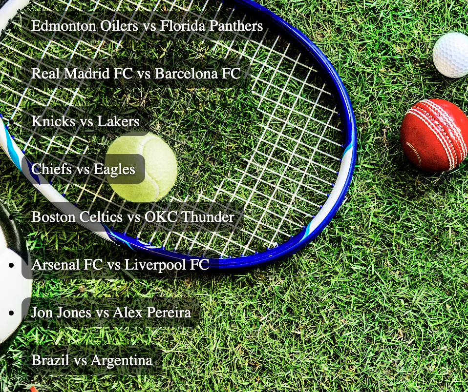
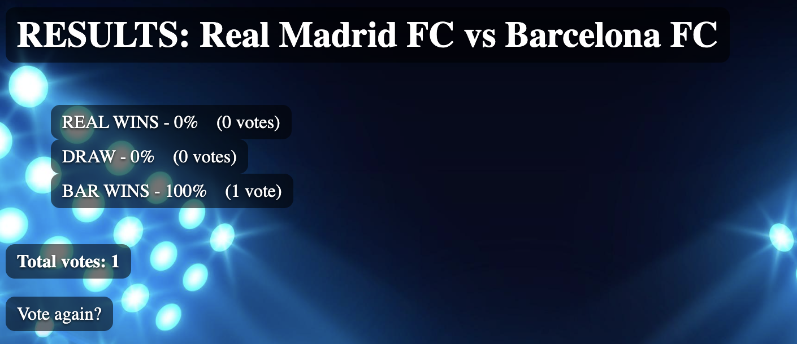

# Sports Predictor ⚽️🏀🏈
A lightweight Django web app where users can predict on sports outcomes,
see real-time results, and manage sports and predictions through an admin dashboard.
Built with clean project structure, database migrations, and extensible
API tooling (DRF + filtering) to support future features.

# **LIVE DEMO**
<div align="center">
  
  <br/>
  
  <br/> 
  
</div>

## Key features
- **Prediction flow:** users can select and submit predictions.

- **Results analytics:** results page shows both predictions totals and percentages

- **Admin dashboard:** manage sports questions/choices and view stored data

## Tech stack
- **Backend:** Django 5.2.10

- **Database:** SQLite (local, default)

- **Tooling / Extensions:** Django REST Framework, django-filter, django-debug-toolbar

## How to run the project

### 1) Activate virtual environment
```bash
source venv/bin/activate
```

### 2) Install dependencies
```bash
pip install -r requirements.txt
```

### 3) Apply migrations
```bash
python3 manage.py migrate
```

### 4) Run server
```bash
python3 manage.py runserver
```

**Open in browser:**
- **http://127.0.0.1:8000/polls/**
- **http://127.0.0.1:8000/admin/**

## Django version used
`Django 5.2.10`
    

## Third-party package description
    
- **djangorestframework:** provides tools for building REST APIs in Django (authentication URLs enabled via api-auth/).
    
- **django-filter:** adds clean, reusable filtering for querysets (commonly used with DRF to filter API results).
    
- **django-debug-toolbar:** adds an in-browser debug panel for inspecting SQL queries, request timing, and settings during development.

## Author
`Kelvin Ihezue`